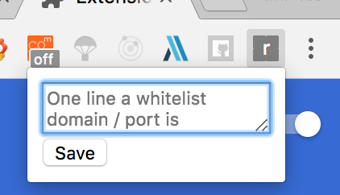

# restc-chrome-extension

restc-chrome-extension is a chrome extension for [restc](https://github.com/elemefe/restc)

> restc is an HTTP server middleware, aiming to enhance debugging experience on RESTful APIs.
> 
> It can be easily integrated with popular HTTP frameworks. You will see:
>
> - formatted JSON responses in the browser
> - a debug panel with which you can send GET, POST, PUT, PATCH and DELETE requests directly in the browser
> You can even share a request by sharing its URL directly to others and everything will be automatically filled in the panel.

### Why a chrome extension

For restc, you must have a server and it's unsafe for online environment.

While for chrome extension, what you need is just set the domain in whitelist and save, refresh the page.

### How to use

Install the extension in [restc page in Chrome Store](https://chrome.google.com/webstore/detail/restc/fgnllkanjopcpnfoloagilbhpiglmgnc)

Click the extension icon and fill in domain in the popup, just save it!

### Questions?

> It don't work correctly!

Some other page handler extension may be conflicted with restc.

More questions can be raised in issue.

### Advice & PR

Issue and PR is welcomed.

For the simplicity of the code, I don't use any build tools such as `webpack` or `pacel`.

### What will you do

- [ ] A global switch to enable / disable restc
- [ ] A more friendly UI for popup
